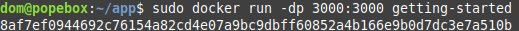

# Docker - First Orbit

We're setting up a Plex Server on an Ubuntu Environment over SSH, doing this in Docker lets me take prebuilt images of the full stack and break them over and over.

## The Docker Tutorial
https://docs.docker.com/get-started/

**Tutorial Goals:**
<br>
- Build and run a containerized image
- Share an image on Docker Hub
- Deploy a *multi-container* Docker application w/ a DB
- Run applications using **Docker Compose**

**Additional Topics:**
- Best practices when building images like scanning your images for security vulnerabilities
- **COMEBACKTOTHISSECTION**

## Starting the Tutorial
`docker run -d -p 80:80 docker/getting-started`

<br>

**Command Flags**
- **-d** Run the container in *detatched mode*
- **-p 80:80** Maps port 80 of the *host* to port 80 of the *container*

<br>

**Accessing the Tutorial**
http://localhost:80 or rather '<server_ip>:80'

<br>

## What is a **Container**?
<br>

A container is **process** isolated from the rest of the processes on the *host machine*. This isolation leverages the **kernel namespaces** and **cgroups**.

The tutorial recommended a series called "Demystified Containers" [linked here](https://medium.com/@saschagrunert/demystifying-containers-part-i-kernel-space-2c53d697950).

## Our Application

The rest of the tutorial works with a simple **Node.js** todo list app.

## Get the app

I needed to modify the proceedure as I am practicing working with Docker on a remote system:

- Use `wget` to download file to PopeBox
- Unzip the directory
- Delete the OG download

Then, I decided to integrate Github into this:
- Downloaded gh CLI
- Authenticated my GH account
- Pushed files to repo


## Building the App's Container Image

We need a `Dockerfile' to build the app, Dockerfiles are text-based scripts of instructions that are used to create a container image.

1. Create file named `Dockerfile' ins the app directory, populated with the following:


```
FROM node:12-alpine
#Adding build tools to make yarn install work on Apple silicon/Arm64 machines
RUN apk add --no-cache python2 g++ make
WORKDIR /app
COPY ..
RUN yarn install --production
CMD ["node", "src/index.js"]
```

2. Open a terminal and build the container with:
```
docker build -t getting-started .
```
- **-t** tags our container with a *human-readable* name
- **.** tells Docker to look in the current directory for the `Dockerfile`

## Starting the App Container
We have an image and now we can run the application.
1. Start the container using the `docker run` command, specifying the image name

```
docker run -dp 3000:3000 getting-started
```

- **-d** runs the container in *detatched* mode, or in the background
- **-p** maps the host's port 3000 to the container's port 3000


